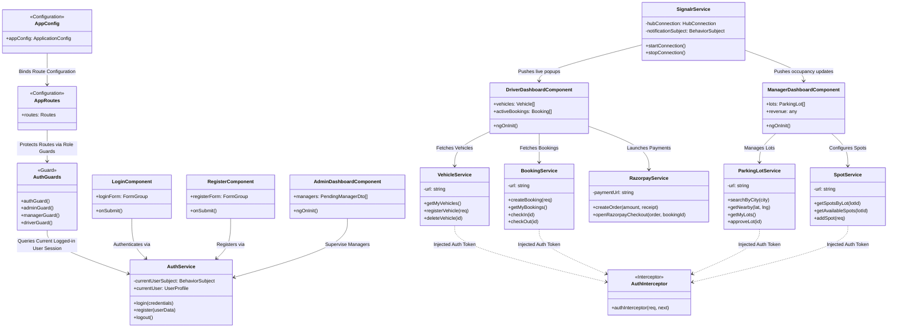
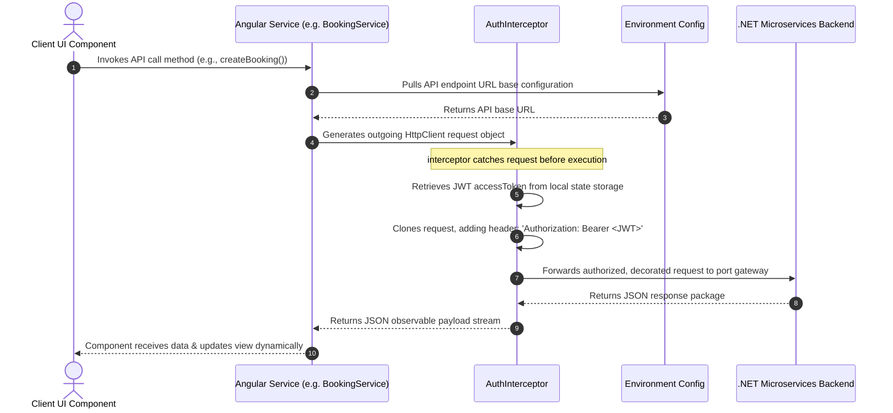

# ParkEase Frontend — Angular 17

Simple Angular 17 frontend for the ParkEase microservices backend.

---

## Project Structure

```
src/
├── app/
│   ├── core/
│   │   ├── guards/           ← auth, admin, manager, driver guards
│   │   ├── interceptors/     ← JWT interceptor
│   │   ├── services/
│   │   │   ├── auth.service.ts
│   │   │   └── api.services.ts   ← all API services
│   │   └── models.ts             ← all TypeScript interfaces
│   ├── features/
│   │   ├── auth/
│   │   │   ├── login/
│   │   │   └── register/
│   │   ├── admin/
│   │   │   ├── admin-dashboard/
│   │   │   ├── manage-managers/
│   │   │   ├── manage-drivers/
│   │   │   ├── manage-lots/
│   │   │   └── manage-bookings/
│   │   ├── manager/
│   │   │   ├── manager-dashboard/
│   │   │   ├── my-lots/
│   │   │   ├── manage-spots/
│   │   │   └── lot-bookings/
│   │   ├── driver/
│   │   │   ├── driver-dashboard/
│   │   │   ├── search-lots/
│   │   │   ├── lot-detail/
│   │   │   ├── my-vehicles/
│   │   │   ├── my-bookings/
│   │   │   └── my-payments/
│   │   └── shared/
│   │       └── navbar/
│   ├── app.component.ts
│   ├── app.config.ts
│   └── app.routes.ts
└── environments/
    └── environment.ts
```

---

## Low-Level Design (LLD) Architectural Diagram

### 1. Structural Class & Data Flow Interaction (UML Class Map)

The following diagram maps the low-level interactions across components, guards, services, and models, illustrating the exact sequence of data flow during client-server operations.



---

### 2. Client-Server Outgoing Request Pipeline (Sequence Design)

This low-level sequence diagram demonstrates how an outgoing HTTP call is built, dynamically decorated with security headers, and executed against your .NET Microservices API Gateway:



---

## Setup & Run

```bash
# 1. Install dependencies
npm install

# 2. Run development server
ng serve

# App opens at http://localhost:4200
```

---

## Backend Service URLs (environment.ts)

```typescript
authUrl:         'http://localhost:7002/api/v1'
vehicleUrl:      'http://localhost:7004/api/v1'
parkingLotUrl:   'http://localhost:5003/api/v1'
spotUrl:         'http://localhost:5002/api/v1'
bookingUrl:      'http://localhost:5001/api/v1'
paymentUrl:      'http://localhost:5006/api/v1'
notificationUrl: 'http://localhost:5008/api/v1'
```

Update these if your services run on different ports.

---

## Default Admin Credentials

```
Email:    admin@parkease.com
Password: Admin@123
```

---

## Pages by Role

### Admin
| Page | Route |
|------|-------|
| Dashboard | /admin |
| Manage Managers | /admin/managers |
| Manage Drivers | /admin/drivers |
| Manage Lots | /admin/lots |
| All Bookings | /admin/bookings |

### Manager
| Page | Route |
|------|-------|
| Dashboard | /manager |
| My Lots | /manager/lots |
| Manage Spots | /manager/lots/:id/spots |
| Lot Bookings | /manager/bookings |

### Driver
| Page | Route |
|------|-------|
| Dashboard | /driver |
| Find Parking | /driver/search |
| Lot Detail + Book | /driver/lots/:id |
| My Vehicles | /driver/vehicles |
| My Bookings | /driver/bookings |
| My Payments | /driver/payments |

---

## CORS Fix for Backend

If you see CORS errors, make sure each backend service has CORS enabled.
All services already have `AllowAll` CORS policy in `Program.cs`.

---

## Build for Production

```bash
ng build --configuration production
# Output in dist/parkease-frontend/
```
